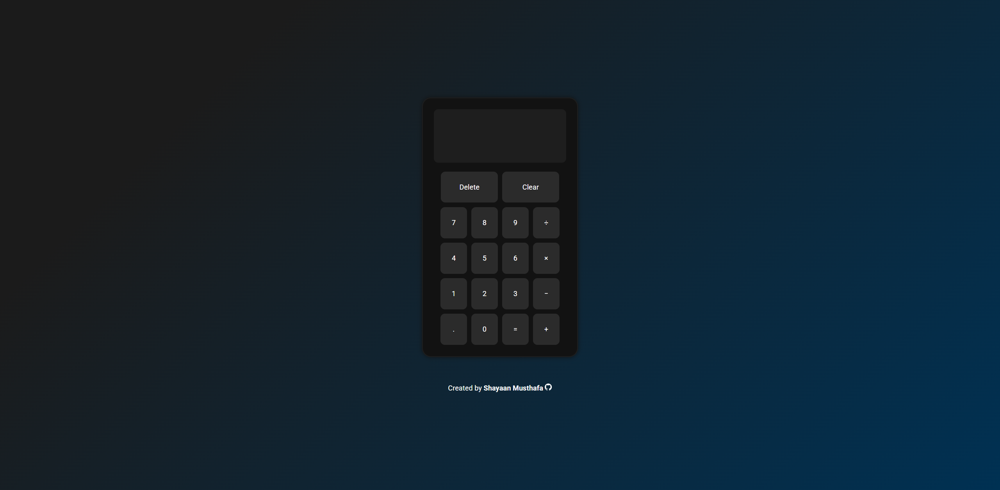

# Calculator

## About

A Calculator project built as part of [The Odin Project's Foundations course](https://www.theodinproject.com/lessons/foundations-calculator).

**Calculator** is a web-based arithmetic calculator that performs basic mathematical operations with a clean, responsive design.

It allows you to perform operations such as:
- Addition (+)
- Subtraction (-)
- Multiplication (×)
- Division (÷)

Additional features include:
- Decimal Input - Supports floating-point numbers.
- Clear Button - Resets all stored values and starts a fresh calculation.
- Delete Button - Removes the last digit of the current number.
- Keyboard Support - Use your keyboard to input numbers and operators.
- Rounded Results - Handles long decimal results.
- Error Handling - Displays a fun message when dividing by zero.

## Preview

## Technologies Used

- HTML5
- CSS3
- JavaScript (ES6)
- Google Fonts (Roboto)

## Credits

**Favicon Icon**

- [Calculator icon](https://www.flaticon.com/free-icon/calculator_2374370) created by Freepik - Flaticon

## Contact

Created by [Shayaan Musthafa](https://github.com/shayaan183).